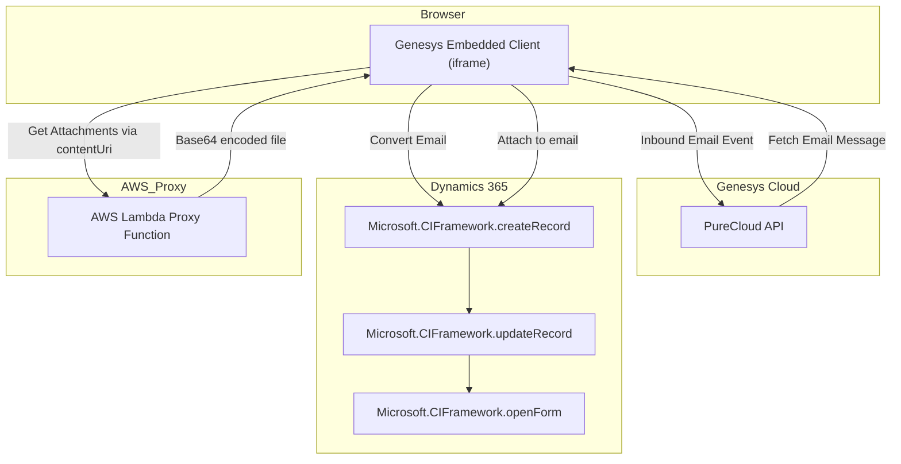

# Genesys Embeddable Framework → Dynamics 365 Email Integration

This document describes the data flow and core architecture of the integration between Genesys Cloud's Embeddable Framework and Microsoft Dynamics 365. The integration is implemented using an iframe inside Dynamics and uses an AWS Lambda proxy for secure email attachment retrieval.

## Overview

- **Genesys Embeddable Framework** is embedded into **Dynamics 365** as an iframe.
- When a new **email interaction** arrives in Genesys, it triggers the data flow.
- The email and its metadata (participants, subject, body, etc.) are transferred to **Dynamics CRM**.
- Email attachments are downloaded through a secure **AWS Lambda proxy**, base64 encoded, and added to the Dynamics email record.
- Upon successful creation, the email form is opened in Dynamics UI.

## Data Flow Diagram (Mermaid)



## Description of Key Steps

### 1. Initialization

- `handleInitialSetup` loads the PureCloud API and Microsoft CIF.
- Subscribes to email interactions using Genesys' `PureCloud.subscribe`.

### 2. Email Processing

- For each incoming **inbound email**:
  - Converts metadata (sender, recipients, subject, body, time) into Dynamics format.
  - Creates a new `email` record in Dynamics using `Microsoft.CIFramework.createRecord`.
  - Updates status with `Microsoft.CIFramework.updateRecord`.
  - Opens the form with `Microsoft.CIFramework.openForm`.

### 3. Attachment Handling

- Each attachment’s `contentUri` is securely proxied through an **AWS Lambda**.
- The Lambda follows redirects, fetches the file, and returns it as base64.
- The frontend converts and uploads it to Dynamics as `activitymimeattachment`.

### 4. **✅ FedRAMP compliance focus:**

* Hosted in AWS **GovCloud**, not standard AWS.
* No logging of file content or metadata.
* No access to external third-party services.
* Pure function: accepts URL, returns base64 blob.
* 📍 **Always operates inside FedRAMP environment.**

---

## 📊 Architecture Diagram

```mermaidflowchart TD
  subgraph FedRAMP_Browser_Environment
    A[Genesys Widget]
    B[Microsoft Dynamics 365]
  end

  subgraph FedRAMP_Genesys_Cloud
    C[PureCloud API]
  end

  subgraph FedRAMP_AWS_GovCloud
    D[Lambda Proxy: Attachment Fetcher]
  end

  A -->|Email Interaction Notification| C
  C -->|Fetch Metadata| A
  A -->|Invoke MicrosoftCIF SDK| B
  B -->|createRecord / updateRecord / openForm| B
  A -->|Get Attachment (contentUri)| D
  D -->|Base64 Attachment| A
  A -->|Attach to Email Record| B

```

---

## ❌ What’s *Not* Happening (FedRAMP Boundaries Maintained)

* No request goes to public APIs or CDN services outside FedRAMP.
* No storage of emails or attachments in intermediate locations.
* No analytics or telemetry beyond basic logging inside approved regions.
* No frontend code injects or modifies external scripts at runtime.
* No access to non-FedRAMP data, environments, or identities.

---
### 5. Final Steps

- If everything succeeds, the email is shown in Dynamics.
- If it fails, Genesys reroutes the interaction to a fallback queue.

## Technologies Used

- **Genesys Embeddable Framework (PureCloud API)**
- **Microsoft Dynamics 365 CRM JavaScript API (CIFramework)**
- **AWS Lambda (Node.js Proxy Function)**

---

© 2025 — Integration Author: You
