# Genesys Embeddable Framework → Dynamics 365 Email Integration

This document describes the data flow and core architecture of the integration between Genesys Cloud's Embeddable Framework and Microsoft Dynamics 365. The integration is implemented using an iframe inside Dynamics and uses an AWS Lambda proxy for secure email attachment retrieval.

## Overview

- **Genesys Embeddable Framework** is embedded into **Dynamics 365** as an iframe.
- When a new **email interaction** arrives in Genesys, it triggers the data flow.
- The email and its metadata (participants, subject, body, etc.) are transferred to **Dynamics CRM**.
- Email attachments are downloaded through a secure **AWS Lambda proxy**, base64 encoded, and added to the Dynamics email record.
- Upon successful creation, the email form is opened in Dynamics UI.

## Data Flow Diagram (Mermaid)

```mermaid
flowchart TD
  subgraph Browser
    A["Genesys Embedded Client"]
  end

  subgraph Genesys Cloud
    B["PureCloud API"]
  end

  subgraph Dynamics 365
    C["Сreate new incomming email"]
    D["Update email with content data"]
    E["Open created email"]
  end

  subgraph AWS_Proxy
    F["AWS Lambda Proxy Function"]
  end

  A -->|Inbound Email Event| B
  B -->|Fetch Email Message| A
  A -->|Convert Email| C
  C --> D
  D --> E
  A -->|Get Attachments via contentUri| F
  F -->|Base64 encoded file| A
  A -->|Attach to email| C

```

## Data Flow Description

### 1. Genesys Embedded Client Integration

  - The Genesys Cloud iframe client is embedded directly inside the Dynamics 365 application UI.
  - This iframe serves as the user interface for all Genesys communication, securely integrated into Dynamics.

### 2. Inbound Email Received

  - When an inbound email arrives in Genesys Cloud, an event is emitted inside the embedded iframe.
  - The iframe receives the email event securely and triggers the processing flow.

### 3. Dynamics Record Creation

  - A new email record is created in Dynamics 365.
  - This record acts as a container for metadata, content, and future updates.

### 4. Message Data Extraction

  - Genesys API is used (via the embedded client) to read all metadata and message content.
  - This information is then passed securely to Dynamics 365.

### 5. Attachment Handling

  - If the email contains attachments, the Genesys content URI is sent to a FedRAMP-compliant **AWS Lambda** proxy.
  - This proxy securely fetches and base64-encodes the attachments without any external exposure.
  - Attachments are returned directly to the embedded client and then passed to Dynamics.

### 6. Finalize Email Record

  - Attachments and message content are linked to the Dynamics 365 email record.
  - The email form is opened in full-screen view for agent interaction.

### 7. Error Handling

  - The entire flow includes robust error detection.
  - If any stage fails (e.g., file fetch or record update), fallback logic is triggered to inform the user and prevent data loss.
     
## ✅ FedRAMP compliance focus:

* No logging of file content or metadata.
* No access to external third-party services.
* Pure function: accepts URL, returns base64 blob.
* 📍 **Always operates inside FedRAMP environment.**

---

## ✅ FedRAMP Assurance Summary

| Component                         | FedRAMP-Approved? | Notes                                                              |
| --------------------------------- | ----------------- | ------------------------------------------------------------------ |
| **Genesys Embedable Framework** | ✅                 | Hosted and accessed via FedRAMP-authorized endpoints               |
| **Microsoft Dynamics 365**    | ✅                 | Dynamics instance runs in U.S. Government cloud (GCC)              |
| **AWS Lambda (GovCloud)**         | ✅                 | Custom proxy runs exclusively in AWS GovCloud with limited scope   |
| **Communication over HTTPS**      | ✅                 | No plaintext transmission; all services use secure TLS connections |
| **No Third-Party Calls**          | ✅                 | All code paths stay inside the authorized environment              |
| **No Persistent Storage**         | ✅                 | The proxy returns binary responses; no logging or external storage |

---

## 🔐 Security & Isolation Highlights

* 🔐 **No outbound traffic to non-FedRAMP environments**.
* 🧩 Genesys and Dynamics integration is entirely **browser-contained** and operates within two FedRAMP-cleared environments.
* 🛡️ AWS proxy is used strictly for secure file delivery via base64 — no analytics, storage, or external API usage.
* 📜 All code respects FedRAMP logging and data handling practices (no unauthorized persistence or leakage).
* 🚫 **No dynamic script loading from external or third-party domains** — all resources are embedded and static.

---

## ❌ What’s *Not* Happening (FedRAMP Boundaries Maintained)

* No request goes to public APIs or CDN services outside FedRAMP.
* No storage of emails or attachments in intermediate locations.
* No analytics or telemetry beyond basic logging inside approved regions.
* No frontend code injects or modifies external scripts at runtime.
* No access to non-FedRAMP data, environments, or identities.

---
### 5. Final Steps

- If everything succeeds, the email is shown in Dynamics.
- If it fails, Genesys reroutes the interaction to a fallback queue.

## Technologies Used

- **Genesys Embeddable Framework (PureCloud API)**
- **Microsoft Dynamics 365 CRM JavaScript API (CIFramework)**
- **AWS Lambda (Node.js Proxy Function)**

---

© 2025 — Integration Author: You
