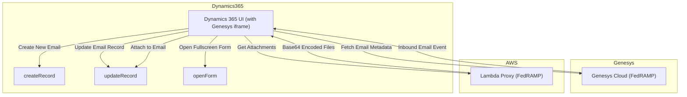
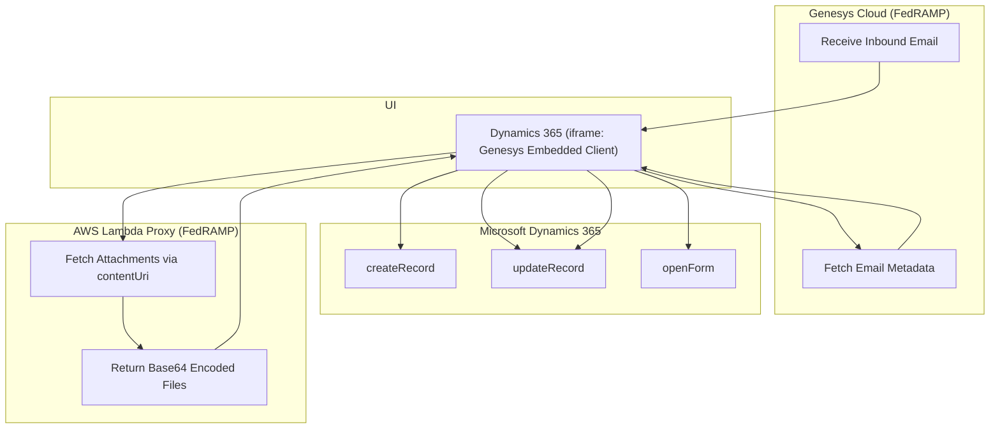

# Genesys–Dynamics 365 Integration: FedRAMP-Compliant Data Flow

## Overview

This document describes a secure and fully FedRAMP-compliant integration between Genesys Cloud and Microsoft Dynamics 365. The integration ensures that all user data, interactions, and email content — including attachments — are processed entirely within a secure, government-compliant boundary.

The core of this architecture is a tightly coupled communication flow where Genesys Cloud interacts with Dynamics 365 via an embedded client (iframe), supported by a custom AWS Lambda proxy that securely fetches attachments without ever leaving the FedRAMP perimeter.

## Key Objectives

- Ensure no data or attachments leave the FedRAMP-compliant environment.
- Use embedded integrations (no external redirects or services).
- Handle inbound email interactions with full automation and error handling.

---

## Data Flow Description

1. **Genesys Embedded Client Integration**
   - The Genesys Cloud iframe client is embedded directly inside the Dynamics 365 application UI.
   - This iframe serves as the user interface for all Genesys communication, securely integrated into Dynamics.

2. **Inbound Email Received**
   - When an inbound email arrives in Genesys Cloud, an event is emitted inside the embedded iframe.
   - The iframe receives the email event securely and triggers the processing flow.

3. **Dynamics Record Creation**
   - A new email record is created in Dynamics 365 using `Microsoft.CIFramework.createRecord`.
   - This record acts as a container for metadata, content, and future updates.

4. **Message Data Extraction**
   - Genesys API is used (via the embedded client) to read all metadata and message content.
   - This information is then passed securely to Dynamics 365 using `Microsoft.CIFramework.updateRecord`.

5. **Attachment Fetching (via AWS Lambda)**
   - If the email contains attachments, the Genesys content URI is sent to a FedRAMP-compliant AWS Lambda proxy.
   - This proxy securely fetches and base64-encodes the attachments without any external exposure.
   - Attachments are returned directly to the embedded client and then passed to Dynamics.

6. **Finalize Email Record**
   - Attachments and message content are linked to the Dynamics 365 email record.
   - The email form is opened in full-screen view using `Microsoft.CIFramework.openForm` for agent interaction.

7. **Error Handling**
   - The entire flow includes robust error detection.
   - If any stage fails (e.g., file fetch or record update), fallback logic is triggered to inform the user and prevent data loss.

---

## Security and FedRAMP Boundary Compliance

- **All communication remains within the FedRAMP-authorized environments:**
  - Genesys Cloud (FedRAMP-authorized)
  - Microsoft Dynamics 365 Government Cloud (FedRAMP High)
  - AWS GovCloud Lambda Proxy (FedRAMP High)

- **No third-party services or external APIs** are used.
- Attachments are never stored externally or routed through non-compliant services.
- All iframe communications occur inside the same browser context and are governed by CSP policies.

---

## Mermaid Data Flow Diagram

